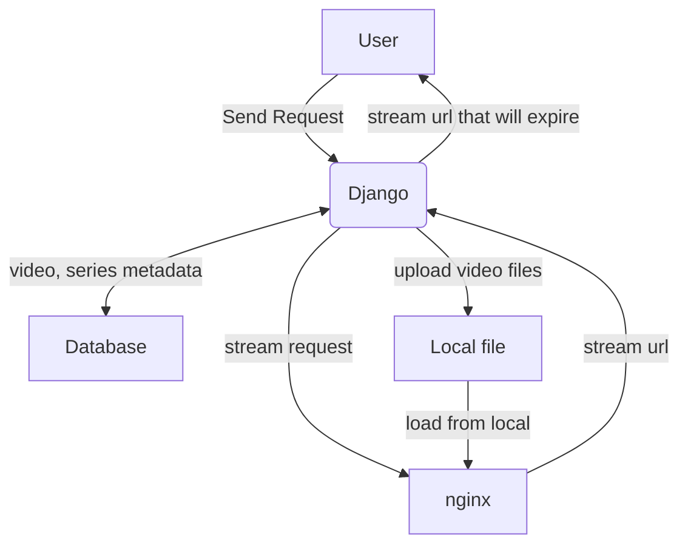

# This branch is for restful version website

(This repo is not finish yet)

# Architecture

# Usage

## Run as test server

1. Clone the repository 
`git clone https://github.com/robinsonweng/savagetime/tree/restful`

2. Create a python virtual enviroment using virtualvenv 
`virtualvenv venv`

3. Load the enviroment 
`source venv`

4. Install python dependency 
`pip install -r requirements.txt`

5. Run the script 
`./script/run.sh`

## deploy on uwsgi
`uwsgi -ini uwsgi.ini`

## Start nginx stream service

Link config folder under local nginx config file
`cd savage_nginx_conf`
`./link_this_dir.sh`

Then run scrpit to start nginx
`cd scrpit`
`./nginx_start.sh`