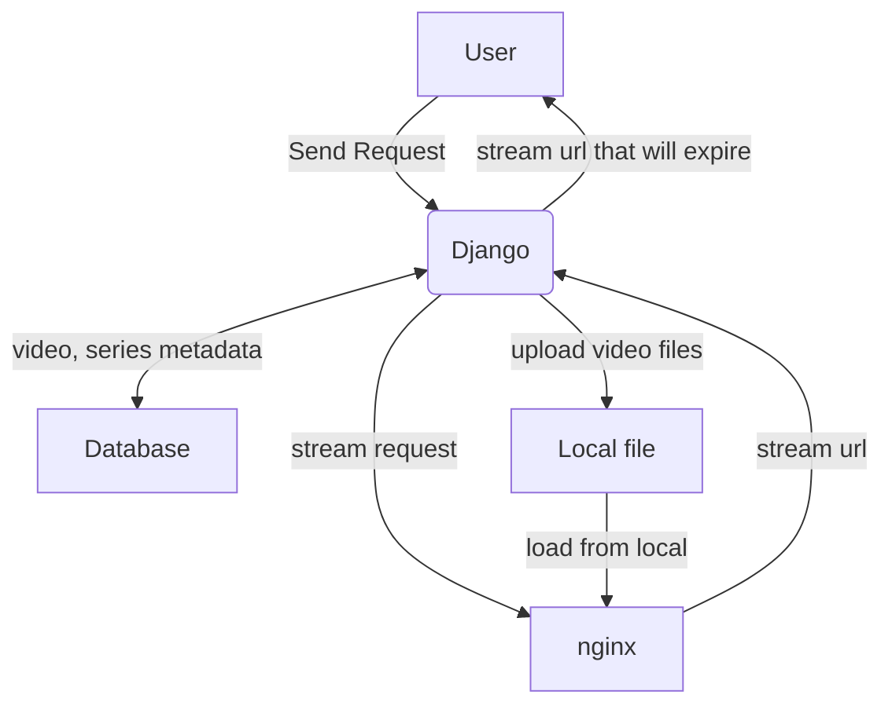

# This branch is for restful version website

(This repo is not finish yet)

# Architecture



# Usage

## Run as test server

1. Clone the repository<br>
`git clone https://github.com/robinsonweng/savagetime/tree/restful`

2. Create a python virtual enviroment using virtualvenv<br>
`virtualvenv venv`

3. Load the enviroment<br>
`source venv`

4. Install python dependency<br>
`pip install -r requirements.txt`

5. Run the script<br>
`./script/run.sh`

## deploy on uwsgi
`uwsgi -ini uwsgi.ini`


## Start nginx stream service

Link config folder under local nginx config file
`cd savage_nginx_conf`
`./link_this_dir.sh`

Then run scrpit to start nginx
`cd scrpit`
`./nginx_start.sh`


# API operation

## Video upload

### [GET]  `/video/{video_id}/stream`
get the stream url from current video

receves:
```
video_id: string
```
response:
`A video streaming url`


### [POST] `/video/upload`
Create a video metadata

receve:
```
{
    "series_name: "string",
    "episode": "string",
    "file_name": "string"
}
```
response:
```
200 ok
```

### [PATCH] `/video/upload`
This route do two things: 1. start a upload session 2. check the status of an upload 3. resume the upload
receve:
```
upload_id: string
```

response:
```
200 ok
```

### [DELETE] `/video/upload`
clear the upload session(not nessary the local file)

receve:
```
upload_id: string
```

## Video info

### [GET] `/video/{video_id}/info`
Get the metadata of the video
receve:
```
video_id: string
```
response:
```
{
    "uuid": "string",
    "series_name": "string",
    "episode": "string",
    "update_time": "string"
}
```

### [PATCH] `/video/{video_id}/info`
update metadata of the video
receve:
```
    {
        "episode": "string",
        "file_name": "string"
    }
```

### [DELETE] `/video/{video_id}/info`
delete the video
receve:
```
video_id: string
```

response:
```
200 ok
```

### [POST] `/video/info`
upload the vieo info

### [GET] `/video/{video_id}/series`
Get series from video id

## Series


## Search

### [GET] `/series/info`
Get metadata of the info

this route return the urls of the video, not streaming url from nginx

@series_id: the uuid of the series

@index: the range of the video episodes, e.g. 1-2 means

episode 1 and 2, the amound of video shouldn't exceed 30

@recent: if true, return the recent updated videos(1d)

receve:
```
series_id: string
index: string
recent: bool
```

response:
```
{
    "uuid": "string",
    "series_name": "string",
    "episode": "string",
    "update_time": string"
}
```

### [POST] `/series/info`
receve:
```
{
    "name": "string",
    "season": "string",
    "episode": int,
    "pub_year": "string",
    "pub_month": "string",
    "finale": true,
    "subtitle_group: "string"
}
```
response:
```
200 ok
```

### [PATCH] `/series/{series_id}/info`
receve:
```
{
    "name": "string",
    "season": "string",
    "episode": int,
    "pub_year": "string",
    "pub_month": "string",
    "finale": true,
    "subtitle_group: "string"
}
```


### [DELETE] `/series/{series_id}/info`
delete the series
receve: 
```
series_id: string
```

response:
```
200 ok
```